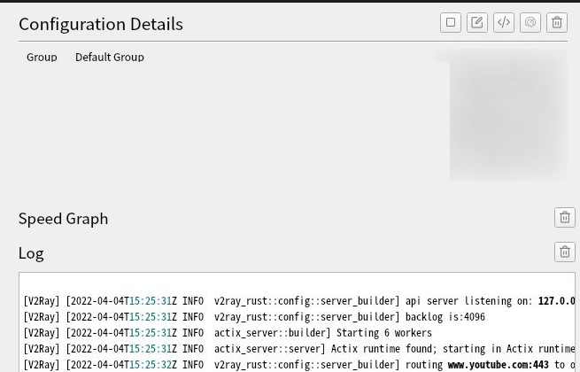

# v2ray-rust
[](https://github.com/Qv2ray/v2ray-rust/actions/workflows/rust.yml)
[](https://deps.rs/repo/github/Qv2ray/v2ray-rust)
[](https://www.gnu.org/licenses/agpl-3.0)

An Opinionated Lightweight Implementation of V2Ray, in Rust Programming Language

## GUI Support

[qv2ray](https://github.com/Shadowsocks-NET/Qv2ray)




## Features

* Proxy chains
* Full Cone UDP for Shadowsocks/Trojan/Direct
* Fast route algorithm
  * Hybrid/Mph Domain matcher
  * Longest prefix match for CIDR route
* ClientHello fingerprinting resistance
* Easy configuration


## Config example

````toml
# default_outbound = "cn"
enable_api_server = true
api_server_addr = "127.0.0.1:1999"

[[ss]]
addr = "127.0.0.1:9000"
password = "123456"
method = "chacha20-poly1305"
tag = "ss0"
[[ss]]
addr = "127.0.0.1:9001"
password = "123456"
method = "chacha20-poly1305"
tag = "ss1"
[[ss]]
addr = "127.0.0.1:9002"
password = "123456"
method = "chacha20-poly1305"
tag = "ss2"
[[ss]]
addr = "127.0.0.1:9004"
password = "123456"
method = "chacha20-poly1305"
tag = "ss3"

[[vmess]]
addr = "127.0.0.1:10002"
uuid = "b831381d-6324-4d53-ad4f-8cda48b30811"
method = "aes-128-gcm"
tag = "v"

[[trojan]]
addr = "127.0.0.1:10003"
password = "password"
tag = "t"

[[ws]]
uri = "ws://127.0.0.1:10002/?ed=2048"
tag = "w"

[[direct]]
tag = "d"

[[h2]]
tag = "h2"
hosts = ["example.org"]
path = "/test"

[[grpc]]
tag = "grpc"
host = "127.0.0.1:10002"
service_name = "gungungun"

[[outbounds]]
chain = ["grpc","v"]
#chain = ["h2","v"]
# chain = ["w","v","ss2"]
# chain = ["t","w","v"]
# chain = ["ss0","ss1","ss2","ss3"]
# chain = ["ss0","ss1","ss2","ss3","w","v"]
# chain = ["ss0"]
# debug
tag = "cn"

[[blackhole]]
tag = "b"


[[outbounds]]
chain = ["d"]
tag = "private"

[[inbounds]]
addr = "127.0.0.1:1087"
enable_udp = true
tag = "mixed"

# [[dokodemo]]
# addr = "127.0.0.1:12345"
# tproxy = true
[[ip_routing_rules]]
tag = "block"
# only block 192.168.0.1 and route 192.168.0.2-192.168.0.254 to other outbounds
cidr_rules = ["192.168.0.1/32"]

[[domain_routing_rules]]
tag = "block"
domain_rules = ["baidu.com"]


# If file path is not provided,
# v2ray-rs will read env varaiable `v2ray.location.asset` or `V2RAY_LOCATION_ASSET` or current exe dir
[[geosite_rules]]
tag = "cn"
# file_path = "your_custom_geosite_file_path"
rules = ["cn"]

# If file path is not provided,
# v2ray-rs will read env varaiable `v2ray.location.asset` or `V2RAY_LOCATION_ASSET` or current exe dir
[[geoip_rules]]
tag = "cn"
# file_path = "your_custom_geoip_file_path"
rules = ["cn"]

# If file path is not provided,
# v2ray-rs will read env varaiable `v2ray.location.asset` or `V2RAY_LOCATION_ASSET` or current exe dir
[[geoip_rules]]
tag="private"
# file_path = "your_custom_geoip_file_path"
rules = ["private"]


[[outbounds]]
chain = ["b"]
tag = "block"

# [[dokodemo]]
# addr = "127.0.0.1:12345"
# tproxy = true
````

## Roadmap

🚧 Interested but not implemented yet ✅ Implemented ❌ Not Interested 🤔 

### geosite fast matcher
- ✅ [DomainMatcher](https://github.com/Qv2ray/DomainMatcher)

### geoip fast matcher
- ✅ [CIDRMatcher](https://github.com/Qv2ray/CIDRMatcher)

### Rust generator
- ✅ [gentian: a proc macro that transforms generators to state machines](https://crates.io/crates/gentian)

### socks5
- ✅ socks5 Inbound
- ✅ UDP support

### http
- ✅ http Inbound
- ✅ mixed Inbound

### Vmess

- ✅ Vmess Aead Outbound
- ✅ UDP support

### Shadowsocks

- ✅ Shadowsocks Outbound
- ✅ UDP support

### Trojan
- ✅ Trojan
- ✅ UDP support

### VLESS
- ❌ 

### Chainable Steam
- ✅

### Chainable UDP
- ✅

### Stream settings

- ✅ TLS
- ✅ HTTP/2
- ✅ WebSocket
- ✅ WebSocket-0-rtt
- ✅ gRPC
- ❌ QUIC
- ❌ DomainSocket
- ❌ mKCP

### Router

- ✅ geosite 
- ✅ geoip


